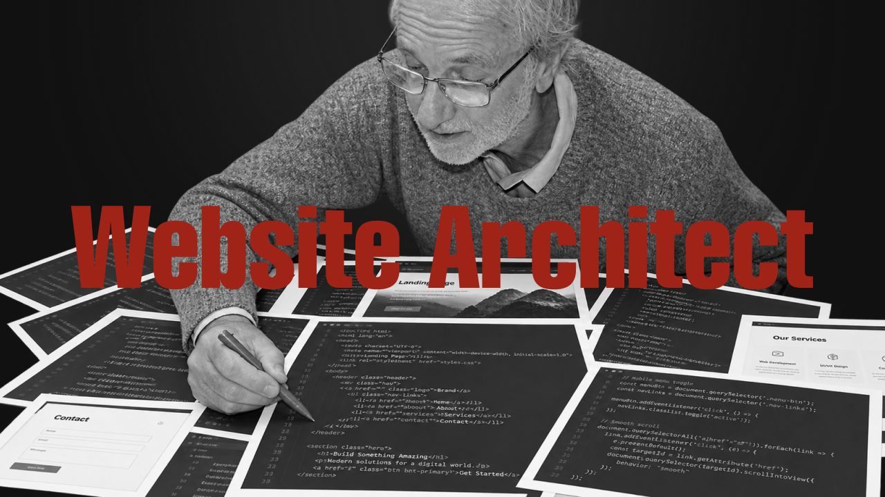

<p align="center">
  
</p>

**Structio** is a Python package and CLI for generating validated
website information architectures from reusable, catalog-driven site profiles.

Define a website type and an architecture mode, and Structio
generates a complete structural model including pages, sections, collections,
reusable templates, and navigation relationships.

The resulting architecture can be validated, serialized to JSON, deserialized,
and consumed by other tools and systems.

## Features

- **Catalog-driven generation** — reusable site profiles define the architecture.
- **10 website types** — Landing Page, SaaS, Agency, Portfolio, Ecommerce,
  Travel, Wellness, Fintech, Technology, and Fashion.
- **Single-page and multi-page architectures** — generate both structural models.
- **Multiple topologies** — Sequential, Hierarchical, and Matrix.
- **Reusable templates** — model repeatable content entities independently from
  the navigation structure.
- **Collections and entry points** — connect dynamic content structures to
  reusable templates.
- **Semantic validation** — enforce structural and template-reference
  constraints at the domain level.
- **Graph-based relationships** — represent navigation and CTA relationships
  between architecture nodes.
- **JSON serialization** — export architectures in a structured,
  machine-readable format.
- **JSON deserialization and round-trip** — restore and validate previously
  generated architectures.
- **Python API and CLI** — use Structio programmatically or directly
  from the terminal.
- **Deterministic generation** — the same profile and configuration produce
  the same architecture.

## Installation

Structio requires **Python 3.11** or **later**.

### Install from source

Clone the repository and install the package in editable mode:

```
git clone <repository-url>
cd structio
python -m pip install -e .
```

This installs Structio together with its CLI command:

```
structio
```

Verify the installation:

```
structio --help
```

### Development installation

To install the development dependencies, including the test suite:

```
python -m pip install -e ".[dev]"
```

You can then run the complete test suite with:

```
python -m pytest
```

A successful installation should allow both the Python package and the `structio` CLI to be used directly from the environment.

## CLI

Structio provides a command-line interface for generating website architectures directly from the terminal.

The main command is:

```
structio
```

### Generate an architecture

Use the generate command:

```
structio generate --type ecommerce --mode multi_page
```

By default, the generated architecture is written to standard output.

To save the generated architecture as a JSON file, use `--output`:

```
structio generate \
    --type ecommerce \
    --mode multi_page \
    --output ecommerce.json
```

On Windows PowerShell, the same command can be written on a single line:

```
structio generate --type ecommerce --mode multi_page --output ecommerce.json
```

### Options

The `generate` command accepts the following options:

| Option     | Description                               |
| ---------- | ----------------------------------------- |
| `--type`   | Website type to generate                  |
| `--mode`   | Architecture mode                         |
| `--output` | Optional path for the generated JSON file |

### Supported website types

```
landing_page
saas
agency
portfolio
ecommerce
travel
wellness
fintech
technology
fashion
```

### Supported modes

```
single_page
multi_page
```

### Examples

Generate a single-page SaaS architecture:

```
structio generate --type saas --mode single_page
```

Generate a multi-page agency architecture:

```
structio generate --type agency --mode multi_page
```

Generate a multi-page portfolio and save it to a file:

```
structio generate \
    --type portfolio \
    --mode multi_page \
    --output portfolio.json
```

### Help

Display the available CLI commands:

```
structio --help
```

Display the options for the `generate` command:

```
structio generate --help
```

The CLI uses the same architecture generation pipeline as the Python API, ensuring that architectures generated from the terminal follow the same catalog definitions, validation rules, templates, graph relationships, and JSON serialization contract.

## Python API

Structio can also be used as a Python library, allowing generated architectures to be integrated directly into other applications and workflows.

### Generate an architecture

```
from structio.domain.enums import SiteMode, SiteType
from structio.generator.generator import ArchitectureGenerator


generator = ArchitectureGenerator()

architecture = generator.generate(
    site_type=SiteType.ECOMMERCE,
    mode=SiteMode.MULTI_PAGE,
)
```

The returned `SiteArchitecture` contains the complete generated architecture, including:

- website type and mode
- topology
- architecture nodes
- reusable templates
- graph relationships
- template references

### Validate an architecture

Generated architectures are validated automatically by the generator.

Validation can also be performed explicitly:

```
architecture.validate()
```

This verifies structural and semantic constraints, including node relationships, parent references, template references, positions, and graph links.

### Serialize an architecture

Use `JsonSerializer` to convert an architecture into the JSON representation:

```
from structio.serializers.json import JsonSerializer


serializer = JsonSerializer()

json_data = serializer.serialize(architecture)

print(json_data)
```

### Save an architecture

The serializer can write the generated architecture directly to a JSON file:

```
serializer.save(
    architecture,
    "ecommerce.json",
)
```

### Complete example

A complete generation workflow can therefore be written as:

```
from structio.domain.enums import SiteMode, SiteType
from structio.generator.generator import ArchitectureGenerator
from structio.serializers.json import JsonSerializer


generator = ArchitectureGenerator()
serializer = JsonSerializer()

architecture = generator.generate(
    site_type=SiteType.ECOMMERCE,
    mode=SiteMode.MULTI_PAGE,
)

serializer.save(
    architecture,
    "ecommerce.json",
)
```

The Python API and CLI use the same underlying generation pipeline. This means architectures generated programmatically follow the same catalog definitions, validation rules, template system, graph construction, and serialization contract as architectures generated through the command line.

## Output Format

Structio generates a structured JSON representation of the website architecture.

The output is designed to be deterministic, machine-readable, and suitable for consumption by other tools or systems.

A generated architecture follows this structure:

```
{
    "version": "1.0",
    "site": {
        "type": "ecommerce",
        "mode": "multi_page",
        "topology": "matrix"
    },
    "root_id": "home",
    "nodes": [],
    "templates": [],
    "links": []
}
```

### Top-level fields

| Field       | Description                                       |
| ----------- | ------------------------------------------------- |
| `version`   | Architecture schema version                       |
| `site`      | Website type, mode, and topology                  |
| `root_id`   | Identifier of the root architecture node          |
| `nodes`     | Concrete nodes composing the website architecture |
| `templates` | Reusable content templates                        |
| `links`     | Relationships between architecture nodes          |

### Site

The `site` object describes the high-level configuration:

```
{
    "type": "ecommerce",
    "mode": "multi_page",
    "topology": "matrix"
}
```

`type` identifies the website profile, while `mode` determines whether the architecture is single-page or multi-page. `topology` describes the structural organization of the generated architecture.

### Nodes

Each node represents a concrete element of the website information architecture:

```
{
    "id": "home.shop",
    "name": "Shop",
    "type": "page",
    "required": true,
    "repeatable": false,
    "purpose": "Provide the main product discovery and browsing experience for the store.",
    "parent_id": "home",
    "position": 0
}
```

Depending on the node type, a node can also contain a template reference:

```
{
    "id": "home.shop.category",
    "name": "Category",
    "type": "collection",
    "required": true,
    "repeatable": false,
    "purpose": "Organize products into meaningful categories for browsing and discovery.",
    "parent_id": "home.shop",
    "position": 0,
    "item_template": "product"
}
```

Entry points use `target_template` instead:

```
{
    "id": "home.product",
    "name": "Product",
    "type": "entry_point",
    "required": true,
    "repeatable": false,
    "purpose": "Provide direct access to individual product pages.",
    "parent_id": "home",
    "position": 1,
    "target_template": "product"
}
```

### Templates

Templates define reusable structures for repeatable content entities:

```
{
    "id": "product",
    "name": "Product",
    "type": "template",
    "required": true,
    "repeatable": true,
    "purpose": "Present an individual product and support product evaluation and purchase."
}
```

Collections reference templates through `item_template`, while entry points reference them through `target_template`.

### Links

Links describe relationships between architecture nodes:

```
{
    "source": "home.shop",
    "target": "home.product",
    "type": "navigation"
}
```

The supported link types are:

- `navigation`
- `cta`

Together, `nodes`, `templates`, and `links` provide a complete machine-readable representation of the generated website architecture.

## Architecture Model

Structio represents a website as a structured information architecture composed of **nodes**, **templates**, and **relationships**.

The model separates the reusable definitions stored in the catalog from the concrete architecture generated for a specific website type and mode.

Core concepts

```
Site Architecture
│
├── Site configuration
│   ├── Type
│   ├── Mode
│   └── Topology
│
├── Nodes
│   ├── Pages
│   ├── Sections
│   ├── Collections
│   └── Entry Points
│
├── Templates
│   └── Reusable content structures
│
└── Graph
    └── Relationships between nodes
```

### Site Architecture

The `SiteArchitecture` is the complete runtime representation produced by the generator.

It contains:

- the architecture version
- website type
- architecture mode
- topology
- root node
- concrete nodes
- reusable templates
- the architecture graph

```
SiteArchitecture(
    version="1.0",
    site_type=SiteType.ECOMMERCE,
    mode=SiteMode.MULTI_PAGE,
    topology=Topology.MATRIX,
    root_id="home",
    nodes=...,
    templates=...,
    graph=...,
)
```

The generated architecture is validated before being returned by the generator.

### Nodes

A `Node` represents a concrete element of the generated information architecture.

Structio supports the following node types:

| Type          | Purpose                                                |
| ------------- | ------------------------------------------------------ |
| `page`        | Represents a website page                              |
| `section`     | Represents a section within a single-page architecture |
| `collection`  | Represents a collection of repeatable entities         |
| `entry_point` | Provides access to an individual template instance     |

Nodes can form hierarchical relationships through `parent_id` and `position`.

For example:

```
home
└── shop
    └── category
```

A collection can reference the template used for its items:

```
Category
    └── item_template → product
```

An entry point can expose the corresponding individual template:

```
Product
    └── target_template → product
```

### Templates

Templates represent reusable structures for repeatable content entities.

They are intentionally separate from navigation nodes.

For example, an ecommerce architecture can define:

```
product
collection
```

The catalog defines these templates once, while generated collections and entry points reference them.

This allows the same architectural model to represent both static website structure and dynamic content entities.

### Graph

The architecture graph represents relationships between nodes.

Each relationship contains:

```
source
target
type
```

The supported relationship types are:

- `navigation`
- `cta`

For example:

```
home.shop
    │
    └── navigation → home.product
```

The graph is therefore complementary to the node hierarchy: `parent_id` describes structural containment, while graph links describe relationships and navigation flows.

### Catalog-driven generation

The architecture model is generated from reusable `SiteProfile` definitions.

The relationship between the catalog and runtime model is:

```
Site Profile
    │
    ├── Page Definitions
    ├── Template Definitions
    └── Link Rules
            ↓
        Architecture Generator
            ↓
        Site Architecture
              │
        ┌─────┼─────┐
        ↓     ↓     ↓
      Nodes Templates Graph
```

This separation allows website profiles to define **what an architecture should contain**, while the generator produces the concrete runtime representation.

### Validation

The architecture model enforces both structural and semantic constraints.

Validation covers:

- root node existence
- unique node IDs
- unique template IDs
- valid parent references
- valid node positions
- valid template references
- collection/entry-point semantics
- valid graph sources and targets
- repeatability constraints

As a result, a generated architecture is not merely a JSON structure: it is a **validated domain model** that can safely be serialized and consumed by downstream systems.

## Development

Structio is designed as a modular Python package with a clear separation between the domain model, architecture catalog, generation pipeline, serialization, and command-line interface.

### Project structure

```
src/
└── structio/
    ├── catalog/
    │   ├── definitions.py
    │   ├── profiles.py
    │   └── ...
    │
    ├── domain/
    │   ├── architecture.py
    │   ├── enums.py
    │   ├── graph.py
    │   ├── links.py
    │   ├── nodes.py
    │   └── templates.py
    │
    ├── generator/
    │   ├── generator.py
    │   └── graph_builder.py
    │
    ├── serializers/
    │   └── json.py
    │
    └── cli.py

tests/
├── catalog/
├── domain/
├── generator/
└── cli/
```

### Development environment

Create a virtual environment:

```
python -m venv .venv
```

Activate it on Windows:

```
.venv\Scripts\Activate.ps1
```

Install the package with development dependencies:

```
python -m pip install -e ".[dev]"
```

### Running tests

The complete test suite can be executed with:

```
python -m pytest
```

The release test matrix covers all supported website types and both architecture modes.
The 326 tests are parameterized pytest tests, not 326 ```test_*``` functions.

For the 1.0.0 release, the complete suite consists of **326 tests**.

### Development workflow

When modifying the project, the recommended workflow is:

1. Modify the relevant domain, catalog, generator, serializer, or CLI component.
2. Add or update the corresponding tests.
3. Run the complete test suite.
4. Verify CLI behavior when the change affects the command-line interface.
5. Verify serialization and round-trip behavior when the architecture model changes.

The catalog should remain the primary source for website-specific architecture definitions. Generator logic should remain generic and should not contain profile-specific website structures.

### Design principle

The project follows a **catalog-driven architecture**:

```
Catalog
   ↓
Generator
   ↓
Domain Model
   ↓
Validation
   ↓
Serialization
   ↓
CLI / External Consumers
```

This separation allows new website profiles to be introduced without duplicating architecture-generation logic.

## Testing

Structio uses `pytest` as its testing framework.

The test suite is organized around the main architectural layers of the project:

```
tests/
├── catalog/
├── domain/
├── generator/
├── serializer/
├── cli/
└── final/
```

### Test coverage

Tests cover:

- catalog definitions and profiles
- domain models and semantic validation
- template references
- architecture generation
- graph construction
- JSON serialization
- JSON deserialization
- serialization round-trip
- CLI commands and arguments
- generated output files
- all supported website types and architecture modes

### Final test matrix

The final integration matrix validates all supported combinations:

**10 website types × 2 architecture modes = 20 combinations**

Each combination is tested through the complete generation pipeline, including:

```
Catalog
    ↓
Generation
    ↓
Domain Validation
    ↓
Graph Validation
    ↓
Serialization
    ↓
Deserialization
    ↓
Round-trip
    ↓
CLI
```

The final **1.0.0** test suite contains **326 tests**, all passing.

### Running the test suite

Run all tests with:

```
python -m pytest
```

For verbose output:

```
python -m pytest -v
```

A successful release validation should conclude with:

```
326 passed
```

The test suite is considered a required validation step before creating a release.

## License

Structio is licensed under the MIT License.

See the [LICENSE](LICENSE) file for the full license text.
